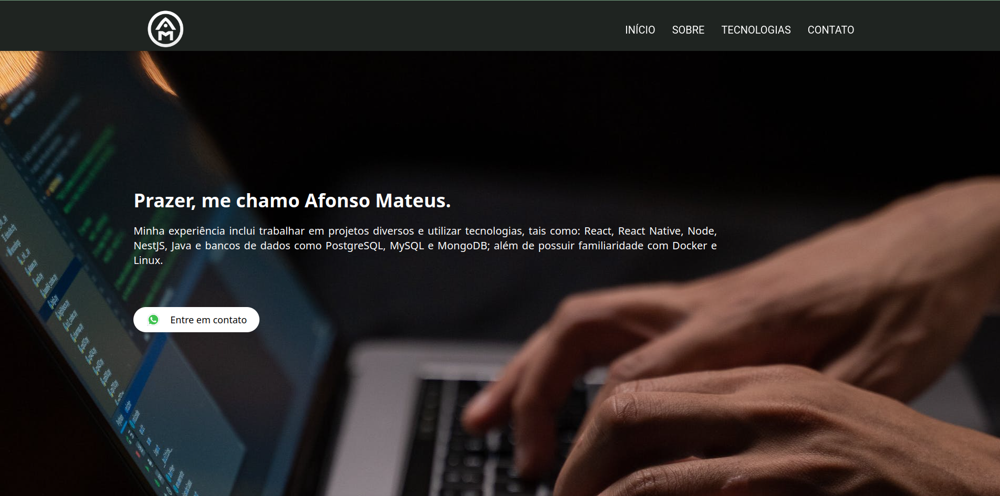
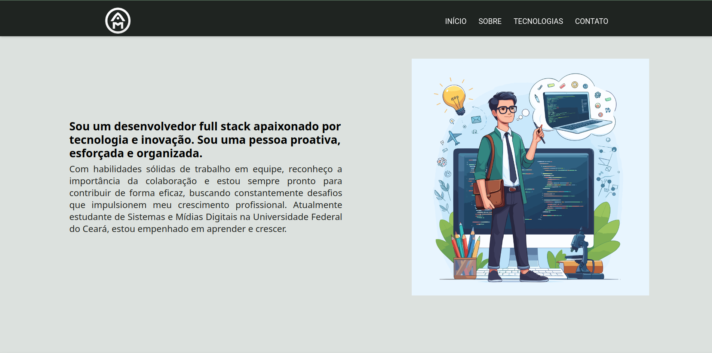
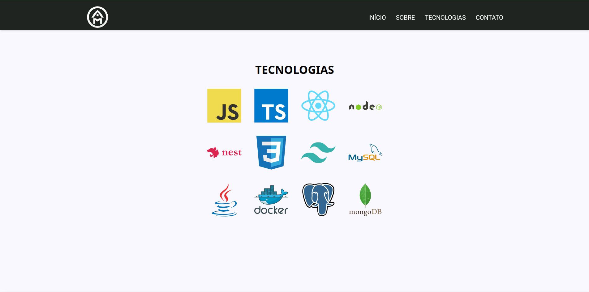

# Portfolio
## Personal website using React

# 💻 About
This project was created to showcase my profile as a software developer and enhance my expertise in Tailwind. 

# 🎨 Layout
### Web





# Instalation
Ensure that you have [Node](https://nodejs.org/en/) and [Git](https://git-scm.com) installed, as well as a package manager such as [Yarn](https://yarnpkg.com/) or [NPM](https://www.npmjs.com/).

### 🎨 Running
```bash
# Clone the repository
$ git clone <https://github.com/afonsomateus21/portfolio.git> or
$ git clone <git@github.com:afonsomateus21/portfolio.git> if you use SSH

# Install dependencies
$ npm install ou yarn install

# Run the application in development mode
$ npm run dev ou yarn dev

# The application will be available on port 5173 - access <http://localhost:5173>
```

# 🛠 Technologies
The following technologies were used in this project construction:
- [TypeScript](https://www.typescriptlang.org/)
- [React](https://react.dev/)
- [Tailwind](https://tailwindcss.com/)

# Author
Afonso Mateus<br/>
<a href="https://www.linkedin.com/in/afonso-mateus-3a8522118/"></a>


# License
This project is under [MIT](https://github.com/afonsomateus21/portfolio/blob/main/LICENSE) license.

Made with ❤️ by Afonso Mateus 👋 [Keep in touch!](https://www.linkedin.com/in/afonso-mateus-3a8522118/)